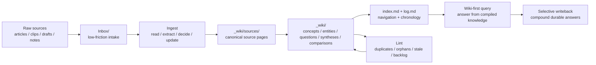

# hermes-llm-wiki

A methodology and skill kit for maintaining a source-grounded, compiled LLM wiki in Obsidian.

## Why this exists

Raw notes are not a knowledge system.

Most note systems accumulate clippings, drafts, and temporary analysis, but they do not automatically become a durable knowledge layer. Agents often make this worse by repeatedly summarizing raw material without maintaining a canonical structure.

`hermes-llm-wiki` exists to package a better operating model:

- keep raw material in `Inbox/`
- compile durable knowledge into `_wiki/`
- treat the agent as a curator/editor, not a chatty summarizer
- prefer selective, traceable writeback over automatic wiki sprawl

## System map

This is the intended operating loop: raw material enters cheaply, compiled knowledge becomes more structured over time, and future answers get better because the wiki itself improves.

## Core operating ideas

- **Raw notes are not compiled knowledge.** `Inbox/` and `_wiki/` serve different roles.
- **Compile selectively.** Not every input deserves a concept page, synthesis, or writeback.
- **Preserve provenance.** Durable pages should point back to source notes or source pages.
- **Answer from the wiki first.** Revisit raw material only when the compiled layer lacks enough evidence.
- **No verification, not complete.** A valid ingest includes canonical placement, navigation updates, and readback checks.
- **Maintenance matters.** Linting for duplicates, orphans, stale pages, and backlog is part of the system.

## Origin: Karpathy's LLM Wiki

This repository is directly inspired by Andrej Karpathy's original **LLM Wiki** gist:

- Original gist: <https://gist.github.com/karpathy/442a6bf555914893e9891c11519de94f>
- Raw gist: <https://gist.githubusercontent.com/karpathy/442a6bf555914893e9891c11519de94f/raw>

Karpathy's core pattern is simple and powerful:
- keep immutable raw sources
- let the LLM maintain a persistent wiki
- use an explicit schema/rules layer to keep the maintainer disciplined
- treat ingest, query, and lint as ongoing operations instead of one-off chat behavior

`hermes-llm-wiki` is not a mirror of that gist. It is a concrete operationalization of the same idea for a Hermes-style agent + Obsidian workflow.

## Why not just RAG?

Standard RAG is useful when you mainly want better query-time retrieval over a pile of source material.

This repository is for a different goal: **turning repeated reading, synthesis, and maintenance into a durable compiled knowledge layer**.

### What plain RAG is good at
- retrieving relevant chunks at question time
- answering against a changing pile of source material
- reducing the need for manual search across notes and files

### What plain RAG usually does not guarantee
- canonical concept/entity pages
- persistent cross-links that improve over time
- explicit navigation surfaces like `index.md`
- append-only operational chronology like `log.md`
- selective writeback of high-value answers
- routine structural maintenance for duplicates, orphans, and stale pages

### The worldview difference

RAG says: *retrieve from the source corpus each time you need an answer.*

This repo says: *compile the source corpus into a maintained wiki so future answers start from a better artifact.*

That is why `hermes-llm-wiki` treats the wiki as a compounding asset, not just a retrieval cache.

## From original idea to Hermes workflow

The distinctive part of this repo is the translation layer from the original LLM Wiki concept into an executable operating model:

- **Raw source space -> `Inbox/`** for low-friction intake, drafts, clips, and unstructured notes
- **Persistent wiki -> `_wiki/`** for compiled, canonical, navigable knowledge
- **Schema -> skills + docs + templates** so the agent behaves like a disciplined maintainer rather than a generic chatbot
- **Ingest/query/lint -> explicit workflows** with clear expectations for provenance, navigation, maintenance, and writeback
- **“Good answers should compound” -> selective writeback** into `questions/` and `syntheses/` instead of losing valuable analysis in chat history

This Hermes translation also makes a few strong choices that are part of the repo's identity:

- wiki-first query posture
- `index.md` and `log.md` as mandatory operational surfaces
- explicit human/Hermes responsibility split
- source-first ingest before abstraction
- structure before automation
- audit-only lint by default

For the deeper design rationale, see [docs/from-llm-wiki-to-hermes.md](docs/from-llm-wiki-to-hermes.md). A Chinese mirror is available at [docs/from-llm-wiki-to-hermes.zh-CN.md](docs/from-llm-wiki-to-hermes.zh-CN.md).

## What this package includes

### Methodology
- a compiled-wiki operating model for Obsidian
- a clear split between source space and compiled knowledge
- writeback, query, ingest, and lint rules

### Skills
- `karpathy-llm-wiki-obsidian` — method/setup/design skill
- `obsidian-inbox-to-wiki-ingest` — execution skill for `Inbox/ -> _wiki/`
- `obsidian-wiki-lint-triage` — audit/maintenance skill for `_wiki/`

The methodology skill keeps the `karpathy-llm-wiki` label because it packages the Karpathy-style compiled-wiki workflow that inspired this operating model.

### Templates
- `_wiki` skeleton files
- page-type templates
- cron prompt templates for triage/lint/digest workflows

### Adoption docs
- host-neutral implementation guide
- Hermes integration notes
- generic-agent integration notes

## Host requirements

This package assumes a host that can do at least these things:

- read and write Markdown files
- keep reusable instruction/skill surfaces
- optionally run recurring prompts on a schedule

If your host cannot do those things, you can still borrow the methodology, but you will need to adapt the workflow manually.

## What this is not

This package is **not**:

- an Obsidian plugin
- a vector database stack
- a graph engine
- a generic RAG framework
- a fully automatic background wiki service
- a “mass-ingest all notes” pipeline

The value is the operating model and reusable skill surfaces, not a heavy runtime.

## Quick start

1. Choose your roots:
   - `INBOX_ROOT` (default: `Inbox/`)
   - `WIKI_ROOT` (default: `_wiki/`)
2. Create the `_wiki/` skeleton from `templates/_wiki/`, including the empty canonical subdirectories:
   - `sources/`
   - `concepts/`
   - `entities/`
   - `questions/`
   - `syntheses/`
   - `comparisons/`
3. Load the three skills from `skills/` into your host agent.
4. Ingest one real source note manually.
5. Verify that:
   - a `_wiki/sources/...` page exists
   - `index.md` gained a curated entry
   - `log.md` records the event
6. Only then add audit-only lint or triage cron prompts.

If you want a concrete first-run path, start with [examples/README.md](examples/README.md).

## Adoption profiles

- **Minimum** — docs + `_wiki` skeleton + one manual ingest flow
- **Standard** — the three skills + page templates + audit-only lint
- **Full** — skills + templates + recurring triage/lint/digest prompts wired into your host scheduler

See [docs/implementation-guide.md](docs/implementation-guide.md).

## Repository map

- `docs/` — doctrine, methodology, rules, and implementation guidance
- `skills/` — reusable public skill surfaces
- `templates/` — `_wiki` skeleton, page templates, cron prompts
- `examples/` — example inputs, outputs, and reports
- `AGENTS.md` — thin read router for adopting agents
- `SOUL.md` — compressed runtime principles
- `MEMORY.md` — durable-memory boundary guidance

## Signature worldview

The key shift is simple:

> Treat the agent as a wiki curator/editor, not a generic chatbot and not a blind auto-ingest daemon.

A good ingest should improve future retrieval, future synthesis, and future answers. A bad ingest only makes the wiki larger.

## For Agents

Read in this order:
1. [SOUL.md](SOUL.md)
2. [MEMORY.md](MEMORY.md)
3. [docs/implementation-guide.md](docs/implementation-guide.md)
4. [skills/README.md](skills/README.md)

Use:
- `karpathy-llm-wiki-obsidian` for methodology and setup
- `obsidian-inbox-to-wiki-ingest` for compilation work
- `obsidian-wiki-lint-triage` for audit and maintenance

Do not:
- mass-ingest raw notes
- auto-create pages for neatness alone
- silently rewrite `_wiki/` during audit-only lint
- treat raw Inbox notes as compiled wiki pages

## License

MIT.
