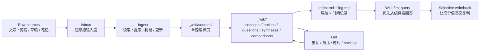

# hermes-llm-wiki

一个面向 Obsidian 的 **LLM 编译式 Wiki 方法论与 Skill 套件**。

## 它为什么存在

原始笔记不是知识系统。

很多笔记库会不断积累剪藏、草稿、研究片段和临时判断，但这些内容不会自动变成一个可持续维护、可复用、可导航的知识层。Agent 如果只是不断“总结”，反而会制造更多重复内容和结构噪声。

`hermes-llm-wiki` 的目标是提供一套更稳的工作模型：

- `Inbox/` 放原始材料
- `_wiki/` 放编译后的 durable knowledge
- 把 agent 当作编译器 / 编辑器 / curator
- 强调 selective writeback，而不是自动膨胀

## 系统示意图

这张图表示的不是一次性流程，而是一个持续循环：原始材料低成本进入，编译知识层逐步变强，后续回答也因此越来越好。

## 核心理念

- **原始材料不等于编译知识。** `Inbox/` 与 `_wiki/` 职责必须分离。
- **选择性编译。** 不是每个输入都值得生成 concept / synthesis / question 页面。
- **保留来源链路。** durable 页面应尽量能追溯回 source note 或 source page。
- **查询时 wiki-first。** 先读 `_wiki/`，只有不够时才回看原始材料。
- **没有验证，就不算完成。** 合格 ingest 必须有 canonical placement、导航更新和回读验证。
- **维护本身就是系统的一部分。** duplicate / orphan / stale / backlog 巡检不能缺位。

## 原始来源：Karpathy 的 LLM Wiki

这个仓库直接参考了 Andrej Karpathy 的原始 **LLM Wiki** gist：

- 原文链接：<https://gist.github.com/karpathy/442a6bf555914893e9891c11519de94f>
- Raw 链接：<https://gist.githubusercontent.com/karpathy/442a6bf555914893e9891c11519de94f/raw>

Karpathy 原始思路的核心是：
- 保留不可变的 raw sources
- 让 LLM 维护一个持久存在的 wiki
- 用显式 schema / rules 层约束维护行为
- 把 ingest、query、lint 视为持续运行的知识工作流，而不是一次性聊天动作

`hermes-llm-wiki` 并不是对那份 gist 的简单转写，而是把它进一步落成适合 Hermes + Obsidian 的可执行工作模型。

## 为什么不直接做 RAG？

标准 RAG 在“对一堆原始资料做查询时检索”这个场景里当然有价值。

但这个仓库追求的是另一件事：**把重复阅读、整理、综合、维护，逐步变成一个可持续复用的 compiled knowledge layer。**

### 纯 RAG 擅长什么
- 在提问时检索相关片段
- 面向不断变化的 source corpus 给出回答
- 降低人工翻文件、翻笔记的成本

### 纯 RAG 通常不保证什么
- 稳定的 concept / entity canonical pages
- 会随着时间持续变好的交叉链接
- 像 `index.md` 这样的显式导航层
- 像 `log.md` 这样的 append-only 编译历史
- 高价值答案的 selective writeback
- 针对 duplicate / orphan / stale page 的周期性知识维护

### worldview 的差别

RAG 的思路更像：*每次需要答案时，再去 source corpus 里检索。*

这个仓库的思路更像：*先把 source corpus 持续编译进一个被维护的 wiki，让未来的问题从更好的知识工件出发。*

所以 `hermes-llm-wiki` 把 wiki 视为一个会复利增长的知识资产，而不只是一个 retrieval cache。

## 从原始概念到 Hermes 落地

这个仓库真正有特色的部分，是把原始 LLM Wiki 概念翻译成一套 Hermes 可执行的 operating model：

- **Raw source space -> `Inbox/`**：低摩擦接收剪藏、草稿、问题、临时分析
- **Persistent wiki -> `_wiki/`**：只承载编译后的 canonical knowledge
- **Schema -> skills + docs + templates**：让 agent 更像 disciplined maintainer，而不是泛化聊天机器人
- **Ingest / query / lint -> 明确工作流**：把来源、导航、维护、回写都变成显式动作
- **“好答案应当复利” -> selective writeback**：把高价值问答沉淀进 `questions/` / `syntheses/`，而不是丢在聊天记录里

这套 Hermes 落地还额外做了几个很强的选择，这些也是本仓库的特色：

- wiki-first query posture
- 把 `index.md` / `log.md` 作为强约束的运行面
- 明确 human / Hermes 分工
- 先 source-first ingest，再决定是否抽象
- 先有结构，再上自动化
- lint 默认 audit-only，不静默改写 `_wiki/`

更完整的设计说明见：[docs/from-llm-wiki-to-hermes.md](docs/from-llm-wiki-to-hermes.md)。中文镜像见：[docs/from-llm-wiki-to-hermes.zh-CN.md](docs/from-llm-wiki-to-hermes.zh-CN.md)

## 仓库包含什么

### 方法论
- Obsidian compiled wiki 的工作模型
- source space 与 compiled layer 的分层约束
- query / ingest / lint / writeback 规则

### Skills
- `karpathy-llm-wiki-obsidian` —— 方法与落地设计
- `obsidian-inbox-to-wiki-ingest` —— `Inbox/ -> _wiki/` 编译执行
- `obsidian-wiki-lint-triage` —— `_wiki/` 巡检与维护

### 模板
- `_wiki` 骨架
- page type 模板
- triage / lint / digest 的 cron prompt 模板

### 落地文档
- host-neutral implementation guide
- Hermes 集成说明
- generic agent 集成说明

## 宿主要求

这套方法默认宿主至少具备这些能力：

- 读写 Markdown 文件
- 挂载可复用 instruction / skill surface
- 可选地调度周期性 prompt

如果宿主做不到这些，也仍然可以借用这套方法论，但需要更多手工适配。

## 它不是什么

它**不是**：

- Obsidian 插件
- 向量数据库方案
- 图谱引擎
- 通用 RAG 框架
- 全自动后台 wiki 服务
- “把所有笔记都自动编译”的流水线

它的价值主要在于：**操作模型、边界和可复用 skill surface**，而不是复杂运行时。

## 快速开始

1. 选择根目录：
   - `INBOX_ROOT`（默认 `Inbox/`）
   - `WIKI_ROOT`（默认 `_wiki/`）
2. 用 `templates/_wiki/` 初始化 `_wiki/` 骨架，并包含这些空的 canonical 子目录：
   - `sources/`
   - `concepts/`
   - `entities/`
   - `questions/`
   - `syntheses/`
   - `comparisons/`
3. 将 `skills/` 下的 3 个 skill 接入你的 agent host。
4. 手动 ingest 一篇真实 source note。
5. 验证：
   - `_wiki/sources/...` 已生成
   - `index.md` 有新的导航项
   - `log.md` 有时间记录
6. 只有当手动流程稳定后，再开启 audit-only lint 或 triage cron。

如果想看一条具体的 first-run 路径，可以从 [examples/README.md](examples/README.md) 开始。

## 采纳层级

- **Minimum**：文档 + `_wiki` 骨架 + 单次手动 ingest
- **Standard**：3 个 skill + page 模板 + audit-only lint
- **Full**：skills + templates + triage/lint/digest 定时提示接入调度器

详见 [docs/implementation-guide.md](docs/implementation-guide.md)。

## For Agents

推荐阅读顺序：
1. `SOUL.md`
2. `MEMORY.md`
3. `docs/implementation-guide.md`
4. `skills/README.md`

用途：
- `karpathy-llm-wiki-obsidian`：方法论与落地设计
- `obsidian-inbox-to-wiki-ingest`：编译执行
- `obsidian-wiki-lint-triage`：巡检与维护

不要：
- 批量无脑 ingest
- 只为“整齐”自动建页
- 在 audit-only lint 中静默改写 `_wiki/`
- 把 Inbox 原始材料当作 compiled wiki 页面

## License

MIT。
